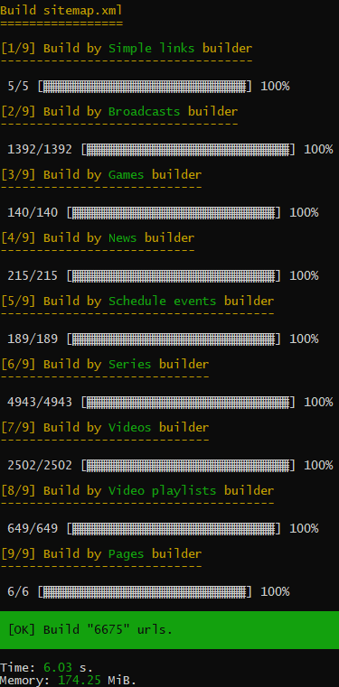

[](https://packagist.org/packages/gpslab/sitemap)
[](https://travis-ci.org/gpslab/sitemap)
[](https://coveralls.io/github/gpslab/sitemap?branch=master)
[](https://scrutinizer-ci.com/g/gpslab/sitemap/?branch=master)
[](https://github.com/gpslab/sitemap)

Sitemap.xml Generation Framework
================================

This is a framework for streaming build Sitemaps.xml and index of Sitemap.xml.

See [Sitemap.xml protocol](https://www.sitemaps.org/protocol.html) for more details.

## Features

 * Streaming build (saves RAM);
 * Parallel multiple streaming;
 * Specify localized URL version;
 * Automatically calculate URL priority;
 * Automatically calculate URL change frequency;
 * Sitemap overflow tracking by total links;
 * Sitemap overflow tracking by used size;
 * [Protocol](https://www.sitemaps.org/protocol.html) compliance tracking;
 * Compression in gzip and deflate;
 * Build a Sitemap for a site section (not only the root `sitemap.xml`);
 * Groups URLs in several Sitemaps;
 * Use URLs building services;
 * Create a Sitemap with several URLs building services;
 * Write a Sitemap to the file;
 * Sends a Sitemap to the output buffer;
 * Write a Sitemap index into the file;
 * Split a Sitemap on overflow;
 * Split a Sitemap on overflow and write a part of Sitemap into the Sitemap.xml index;
 * Write a Sitemap to a temporary folder to save the valid `sitemap.xml` in the destination path during build;
 * Render a Sitemap by [XMLWriter](https://www.php.net/manual/en/book.xmlwriter.php);
 * Render a Sitemap as a plain text without any dependencies;
 * Compressed or formatted XML;
 * XML schema validation.

## Group build

This is an example of how the `sitemap.xml` can be build by your console command. In this example, all site links are
divided into groups and a build service is created for each group. In this example, a sitemap is build from 6675 links,
but this approach also facilitates the build of large site maps for 100000 or 500000 links.



## Installation

Pretty simple with [Composer](https://packagist.org), run:

```sh
composer require gpslab/sitemap
```

## Simple usage

```php
// URLs on your site
$urls = [
    Url::create(
        'https://example.com/', // loc
        new \DateTimeImmutable('2020-06-15 13:39:46'), // lastmod
        ChangeFrequency::always(), // changefreq
        10 // priority
    ),
    Url::create(
        'https://example.com/contacts.html',
        new \DateTimeImmutable('2020-05-26 09:28:12'),
        ChangeFrequency::monthly(),
        7
    ),
    Url::create('https://example.com/about.html'),
];

// file into which we will write a sitemap
$filename = __DIR__.'/sitemap.xml';

// configure stream
$render = new PlainTextSitemapRender();
$writer = new TempFileWriter();
$stream = new WritingStream($render, $writer, $filename);

// build sitemap.xml
$stream->open();
foreach ($urls as $url) {
    $stream->push($url);
}
$stream->close();
```

Result `sitemap.xml`:

```xml
<?xml version="1.0" encoding="UTF-8"?>
<urlset xmlns="https://www.sitemaps.org/schemas/sitemap/0.9">
    <url>
        <loc>https://example.com/</loc>
        <lastmod>2020-06-15T13:39:46+03:00</lastmod>
        <changefreq>always</changefreq>
        <priority>1.0</priority>
    </url>
    <url>
        <loc>https://example.com//contacts.html</loc>
        <lastmod>2020-05-26T09:28:12+03:00</lastmod>
        <changefreq>monthly</changefreq>
        <priority>0.7</priority>
    </url>
    <url>
        <loc>https://example.com/about.html</loc>
    </url>
</urlset>
```

## Change frequency

How frequently the page is likely to change. This value provides general information to search engines and may not
correlate exactly to how often they crawl the page.

You can define it:

 * As string
 
   ```php
   $change_frequency = 'daily';
   ```

 * As constant
 
   ```php
   $change_frequency = ChangeFrequency::DAILY;
   ```

 * As object
 
   ```php
   $change_frequency = ChangeFrequency::daily();
   ```

## Priority

The priority of this URL relative to other URLs on your site. Valid values range from `0.0` to `1.0`. This value does not
affect how your pages are compared to pages on other sites-it only lets the search bots know which pages you deem
most important for the search bots.

You can define it:

 * As string
 
   ```php
   $priority = '0.5';
   ```

 * As float
 
   ```php
   $priority = .5;
   ```

 * As integer
 
   ```php
   $priority = 5;
   ```

 * As object
 
   ```php
   $priority = Priority::create(5 /* string|float|int */);
   ```

## Localized versions of page

If you have multiple versions of a page for different languages or regions, tell search bots about these different
variations. Doing so will help search bots point users to the most appropriate version of your page by language or
region.

```php
// URLs on your site
$urls = [
    Url::create(
        'https://example.com/english/page.html',
        new \DateTimeImmutable('2020-06-15 13:39:46'),
        ChangeFrequency::monthly(),
        7,
        [
            'de' => 'https://example.com/deutsch/page.html',
            'de-ch' => 'https://example.com/schweiz-deutsch/page.html',
            'en' => 'https://example.com/english/page.html',
            'fr' => 'https://example.fr',
            'x-default' => 'https://example.com/english/page.html',
        ]
    ),
    Url::create(
        'https://example.com/deutsch/page.html',
        new \DateTimeImmutable('2020-06-15 13:39:46'),
        ChangeFrequency::monthly(),
        7,
        [
            'de' => 'https://example.com/deutsch/page.html',
            'de-ch' => 'https://example.com/schweiz-deutsch/page.html',
            'en' => 'https://example.com/english/page.html',
            'fr' => 'https://example.fr',
            'x-default' => 'https://example.com/english/page.html',
        ]
    ),
    Url::create(
        'https://example.com/schweiz-deutsch/page.html',
        new \DateTimeImmutable('2020-06-15 13:39:46'),
        ChangeFrequency::monthly(),
        7,
        [
            'de' => 'https://example.com/deutsch/page.html',
            'de-ch' => 'https://example.com/schweiz-deutsch/page.html',
            'en' => 'https://example.com/english/page.html',
            'fr' => 'https://example.fr',
            'x-default' => 'https://example.com/english/page.html',
        ]
    ),
];
```

You can simplify the creation of URLs for localized versions of the same page within the same domain.

```php
$urls = Url::createLanguageUrls(
    [
        'de' => 'https://example.com/deutsch/page.html',
        'de-ch' => 'https://example.com/schweiz-deutsch/page.html',
        'en' => 'https://example.com/english/page.html',
        'x-default' => 'https://example.com/english/page.html',
    ],
    new \DateTimeImmutable('2020-06-15 13:39:46'),
    ChangeFrequency::monthly(),
    7,
    [
        'fr' => 'https://example.fr',
    ]
);
```

Result `sitemap.xml`:

```xml
<?xml version="1.0" encoding="UTF-8"?>
<urlset xmlns="https://www.sitemaps.org/schemas/sitemap/0.9">
    <url>
        <loc>https://example.com/deutsch/page.html</loc>
        <lastmod>2020-06-15T13:39:46+03:00</lastmod>
        <changefreq>monthly</changefreq>
        <priority>0.7</priority>
        <xhtml:link rel="alternate" hreflang="de" href="https://example.com/deutsch/page.html"/>
        <xhtml:link rel="alternate" hreflang="de-ch" href="https://example.com/schweiz-deutsch/page.html"/>
        <xhtml:link rel="alternate" hreflang="en" href="https://example.com/english/page.html"/>
        <xhtml:link rel="alternate" hreflang="x-default" href="https://example.com/english/page.html"/>
        <xhtml:link rel="alternate" hreflang="fr" href="https://example.fr"/>
    </url>
    <url>
        <loc>https://example.com/schweiz-deutsch/page.html</loc>
        <lastmod>2020-06-15T13:39:46+03:00</lastmod>
        <changefreq>monthly</changefreq>
        <priority>0.7</priority>
        <xhtml:link rel="alternate" hreflang="de" href="https://example.com/deutsch/page.html"/>
        <xhtml:link rel="alternate" hreflang="de-ch" href="https://example.com/schweiz-deutsch/page.html"/>
        <xhtml:link rel="alternate" hreflang="en" href="https://example.com/english/page.html"/>
        <xhtml:link rel="alternate" hreflang="x-default" href="https://example.com/english/page.html"/>
        <xhtml:link rel="alternate" hreflang="fr" href="https://example.fr"/>
    </url>
    <url>
        <loc>https://example.com/english/page.html</loc>
        <lastmod>2020-06-15T13:39:46+03:00</lastmod>
        <changefreq>monthly</changefreq>
        <priority>0.7</priority>
        <xhtml:link rel="alternate" hreflang="de" href="https://example.com/deutsch/page.html"/>
        <xhtml:link rel="alternate" hreflang="de-ch" href="https://example.com/schweiz-deutsch/page.html"/>
        <xhtml:link rel="alternate" hreflang="en" href="https://example.com/english/page.html"/>
        <xhtml:link rel="alternate" hreflang="x-default" href="https://example.com/english/page.html"/>
        <xhtml:link rel="alternate" hreflang="fr" href="https://example.fr"/>
    </url>
</urlset>
```

## URL builders

You can create a service that will return a links to pages of your site.

```php
class MySiteUrlBuilder implements UrlBuilder
{
    public function getIterator(): \Traversable
    {
        // add URLs on your site
        return new \ArrayIterator([
          Url::create(
              'https://example.com/', // loc
              new \DateTimeImmutable('2020-06-15 13:39:46'), // lastmod
              ChangeFrequency::always(), // changefreq
              10 // priority
          ),
          Url::create(
              'https://example.com/contacts.html',
              new \DateTimeImmutable('2020-05-26 09:28:12'),
              ChangeFrequency::monthly(),
              7
          ),
          Url::create(
              'https://example.com/about.html',
              new \DateTimeImmutable('2020-05-02 17:12:38'),
              ChangeFrequency::monthly(),
              7
          ),
       ]);
    }
}
```

It was a simple build. We add a builder more complicated.

```php
class ArticlesUrlBuilder implements UrlBuilder
{
    private $pdo;

    public function __construct(\PDO $pdo)
    {
        $this->pdo = $pdo;
    }

    public function getIterator(): \Traversable
    {
        $section_update_at = null;
        $sth = $this->pdo->query('SELECT id, update_at FROM article');
        $sth->execute();

        while ($row = $sth->fetch(PDO::FETCH_ASSOC)) {
            $update_at = new \DateTimeImmutable($row['update_at']);
            $section_update_at = max($section_update_at, $update_at);

            // smart URL automatically fills fields that it can
            yield Url::createSmart(
                sprintf('https://example.com/article/%d', $row['id']),
                $update_at
            );
        }

        // link to section
        if ($section_update_at !== null) {
            yield Url::createSmart('https://example.com/article/', $section_update_at);
        } else {
            yield Url::create(
                'https://example.com/article/',
                new \DateTimeImmutable('-1 day'),
                ChangeFrequency::daily(),
                9
            );
        }
    }
}
```

We take one of the exists builders and configure it.

```php
// collect a collection of builders
$builders = new MultiUrlBuilder([
    new MySiteUrlBuilder(),
    new ArticlesUrlBuilder(/* $pdo */),
]);

// file into which we will write a sitemap
$filename = __DIR__.'/sitemap.xml';

// configure stream
$render = new PlainTextSitemapRender();
$writer = new TempFileWriter();
$stream = new WritingStream($render, $writer, $filename);

// build sitemap.xml
$stream->open();
foreach ($builders as $url) {
    $stream->push($url);
}
$stream->close();
```

## Sitemap index

You can create [Sitemap index](https://www.sitemaps.org/protocol.html#index) to group multiple sitemap files. If you
have already created portions of the Sitemap, you can simply create the Sitemap index.

```php
// file into which we will write a sitemap
$filename = __DIR__.'/sitemap.xml';

// configure stream
$render = new PlainTextSitemapIndexRender();
$writer = new TempFileWriter();
$stream = new WritingIndexStream($render, $writer, $filename);

// build sitemap.xml index
$stream->open();
$stream->pushSitemap(new Sitemap('https://example.com/sitemap_main.xml', new \DateTimeImmutable('-1 hour')));
$stream->pushSitemap(new Sitemap('https://example.com/sitemap_news.xml', new \DateTimeImmutable('-1 hour')));
$stream->pushSitemap(new Sitemap('https://example.com/sitemap_articles.xml', new \DateTimeImmutable('-1 hour')));
$stream->close();
```

Result `sitemap.xml`:

```xml
<?xml version="1.0" encoding="UTF-8"?>
<sitemapindex xmlns:xsi="http://www.w3.org/2001/XMLSchema-instance" xsi:schemaLocation="http://www.sitemaps.org/schemas/sitemap/0.9 http://www.sitemaps.org/schemas/sitemap/0.9/siteindex.xsd" xmlns="http://www.sitemaps.org/schemas/sitemap/0.9">
    <sitemap>
        <loc>https://example.com/sitemap_main.xml</loc>
        <lastmod>2020-06-15T13:39:46+03:00</lastmod>
    </sitemap>
    <sitemap>
        <loc>https://example.com/sitemap_news.xml</loc>
        <lastmod>2020-06-15T13:39:46+03:00</lastmod>
    </sitemap>
    <sitemap>
        <loc>https://example.com/sitemap_articles.xml</loc>
        <lastmod>2020-06-15T13:39:46+03:00</lastmod>
    </sitemap>
</sitemapindex>
```

## Split URLs and make Sitemap index

You can simplify splitting the list of URLs to partitions and creating a Sitemap index.

You can push URLs into the `WritingSplitIndexStream` stream and he will write them to the partition of the Sitemap.
Upon reaching the partition size limit, the stream closes this partition, adds it to the index and opens the next
partition. This simplifies the building of a big sitemap and eliminates the need for follow size limits.

You'll get a Sitemap index `sitemap.xml` and a few partitions `sitemap1.xml`, `sitemap2.xml`, `sitemapN.xml`  from a
large number of URLs.

```php
// collect a collection of builders
$builders = new MultiUrlBuilder([
    new MySiteUrlBuilder(),
    new ArticlesUrlBuilder(/* $pdo */),
]);

// file into which we will write a sitemap
$index_filename = __DIR__.'/sitemap.xml';

$index_render = new PlainTextSitemapIndexRender();
$index_writer = new TempFileWriter();

// file into which we will write a sitemap part
// filename should contain a directive like "%d"
$part_filename = __DIR__.'/sitemap%d.xml';

// web path to the sitemap.xml on your site
$part_web_path = 'https://example.com/sitemap%d.xml';

$part_render = new PlainTextSitemapRender();
// separate writer for part
// it's better not to use one writer as a part writer and a index writer
// this can cause conflicts in the writer
$part_writer = new TempFileWriter();

// configure stream
$stream = new WritingSplitIndexStream(
    $index_render,
    $part_render,
    $index_writer,
    $part_writer,
    $index_filename,
    $part_filename,
    $part_web_path
);

$stream->open();

// build sitemap.xml index file and sitemap1.xml, sitemap2.xml, sitemapN.xml with URLs
foreach ($builders as $url) {
    $stream->push($url);
}

// you can add a link to a sitemap created earlier
$stream->pushSitemap(new Sitemap('https://example.com/sitemap_news.xml', new \DateTimeImmutable('-1 hour')));

$stream->close();
```

As a result, you will get a file structure like this:

```
sitemap.xml
sitemap1.xml
sitemap2.xml
sitemap3.xml
sitemap_news.xml
```

Result `sitemap.xml`:

```xml
<?xml version="1.0" encoding="UTF-8"?>
<sitemapindex xmlns:xsi="http://www.w3.org/2001/XMLSchema-instance" xsi:schemaLocation="http://www.sitemaps.org/schemas/sitemap/0.9 http://www.sitemaps.org/schemas/sitemap/0.9/siteindex.xsd" xmlns="http://www.sitemaps.org/schemas/sitemap/0.9">
    <sitemap>
        <loc>https://example.com/sitemap1.xml</loc>
        <lastmod>2020-06-15T13:39:46+03:00</lastmod>
    </sitemap>
    <sitemap>
        <loc>https://example.com/sitemap2.xml</loc>
        <lastmod>2020-06-15T13:39:46+03:00</lastmod>
    </sitemap>
    <sitemap>
        <loc>https://example.com/sitemap3.xml</loc>
        <lastmod>2020-06-15T13:39:46+03:00</lastmod>
    </sitemap>
    <sitemap>
        <loc>https://example.com/sitemap_news.xml</loc>
        <lastmod>2020-06-15T13:39:46+03:00</lastmod>
    </sitemap>
</sitemapindex>
```

## Split URLs in groups

You may not want to break all URLs to a partitions like with `WritingSplitIndexStream` stream. You might want to make
several partition groups. For example, to create a partition group that contains only URLs to news on your website, a
partition group for articles, and a group with all other URLs.

This can help identify problems in a specific URLs group. Also, you can configure your application to reassemble only
individual groups if necessary, and not the entire map.

***Note.** The list of partitions is stored in the `WritingSplitStream` stream and a large number of partitions
will spend memory.*

```php
// file into which we will write a sitemap
$index_filename = __DIR__.'/sitemap.xml';

$index_render = new PlainTextSitemapIndexRender();
$index_writer = new TempFileWriter();

// separate writer for part
$part_writer = new TempFileWriter();
$part_render = new PlainTextSitemapRender();

$index_stream = new WritingIndexStream($index_render, $index_writer, $index_filename);

// create a stream for news

// file into which we will write a sitemap part
// filename should contain a directive like "%d"
$news_filename = __DIR__.'/sitemap_news%d.xml';
// web path to sitemap parts on your site
$news_web_path = 'https://example.com/sitemap_news%d.xml';
$news_stream = new WritingSplitStream($part_render, $part_writer, $news_filename, $news_web_path);

// similarly create a stream for articles
$articles_filename = __DIR__.'/sitemap_articles%d.xml';
$articles_web_path = 'https://example.com/sitemap_articles%d.xml';
$articles_stream = new WritingSplitStream($part_render, $part_writer, $articles_filename, $articles_web_path);

// similarly create a main stream
$main_filename = __DIR__.'/sitemap_main%d.xml';
$main_web_path = 'https://example.com/sitemap_main%d.xml';
$main_stream = new WritingSplitStream($part_render, $part_writer, $main_filename, $main_web_path);

// build sitemap.xml index
$index_stream->open();

$news_stream->open();
// build parts of a sitemap group
foreach ($news_urls as $url) {
    $news_stream->push($url);
}

// add all parts to the index
foreach ($news_stream->getSitemaps() as $sitemap) {
    $index_stream->pushSitemap($sitemap);
}

// close the stream only after adding all parts to the index
// otherwise the list of parts will be cleared
$news_stream->close();

// similarly for articles stream
$articles_stream->open();
foreach ($article_urls as $url) {
    $articles_stream->push($url);
}
foreach ($articles_stream->getSitemaps() as $sitemap) {
    $index_stream->pushSitemap($sitemap);
}
$articles_stream->close();

// similarly for main stream
$main_stream->open();
foreach ($main_urls as $url) {
    $main_stream->push($url);
}
foreach ($main_stream->getSitemaps() as $sitemap) {
    $index_stream->pushSitemap($sitemap);
}
$main_stream->close();

// finish create index
$index_stream->close();
```

As a result, you will get a file structure like this:

```
sitemap.xml
sitemap_news1.xml
sitemap_news2.xml
sitemap_news3.xml
sitemap_articles1.xml
sitemap_articles2.xml
sitemap_articles3.xml
sitemap_main1.xml
sitemap_main2.xml
sitemap_main3.xml
```

## Streams

 * `MultiStream` - allows to use multiple streams as one;
 * `WritingStream` - use [`Writer`](#Writer) for write a Sitemap;
 * `WritingIndexStream` - writes a Sitemap index with [`Writer`](#Writer);
 * `WritingSplitIndexStream` - split list URLs to sitemap parts and write its with [`Writer`](#Writer) to a Sitemap
 index;
 * `WritingSplitStream` - split list URLs and write its with [`Writer`](#Writer) to a Sitemaps;
 * `OutputStream` - sends a Sitemap to the output buffer. You can use it
[in controllers](https://symfony.com/doc/current/components/http_foundation.html#streaming-a-response);
 * `LoggerStream` - use
 [PSR-3](https://github.com/php-fig/fig-standards/blob/master/accepted/PSR-3-logger-interface.md) for log added URLs.

You can use a composition of streams.

```php
$stream = new MultiStream(
    new LoggerStream(/* $logger */),
    new WritingSplitIndexStream(
        new PlainTextSitemapIndexRender(),
        new PlainTextSitemapRender(),
        new TempFileWriter(),
        new GzipTempFileWriter(9),
         __DIR__.'/sitemap.xml',
         __DIR__.'/sitemap%d.xml.gz',
        'https://example.com/sitemap%d.xml.gz'
    )
);
```

Streaming to file and compress result without index.

```php
$render = new PlainTextSitemapRender();

$stream = new MultiStream(
    new LoggerStream(/* $logger */),
    new WritingStream($render, new GzipTempFileWriter(9), __DIR__.'/sitemap.xml.gz'),
    new WritingStream($render, new TempFileWriter(), __DIR__.'/sitemap.xml')
);
```

Streaming to file and output buffer.

```php
$render = new PlainTextSitemapRender();

$stream = new MultiStream(
    new LoggerStream(/* $logger */),
    new WritingStream($render, new TempFileWriter(), __DIR__.'/sitemap.xml'),
    new OutputStream($render)
);
```

## Writer

 * `FileWriter` - write a Sitemap to the file;
 * `TempFileWriter` - write a Sitemap to the temporary file and move in to target directory after finish writing;
 * `GzipFileWriter` - write a Sitemap to the file compressed by gzip;
 * `GzipTempFileWriter` - write a Sitemap to the temporary file compressed by gzip and move in to target directory
 after finish writing.
 * `DeflateFileWriter` - write a Sitemap to the file compressed by deflate;
 * `DeflateTempFileWriter` - write a Sitemap to the temporary file compressed by deflate and move in to target
 directory after finish writing.

## Render

If you install the [XMLWriter](https://www.php.net/manual/en/book.xmlwriter.php) PHP extension, you can use
`XMLWriterSitemapRender` and `XMLWriterSitemapIndexRender`. Otherwise you can use `PlainTextSitemapRender` and
`PlainTextSitemapIndexRender` who do not require any dependencies and are more economical.

## The location of Sitemap file

The Sitemap protocol imposes restrictions on the URLs that can be specified in it, depending on the location of the
Sitemap file:

 * All URLs listed in the Sitemap must use the same protocol (`https`, in this example) and reside on
   the same host as the Sitemap. For instance, if the Sitemap is located at `https://www.example.com/sitemap.xml`, it
   can't include URLs from `http://www.example.com/` or `https://subdomain.example.com`.
 * The location of a Sitemap file determines the set of URLs that can be included in that Sitemap. A Sitemap file
   located at `https://example.com/catalog/sitemap.xml` can include any URLs starting with
   `https://example.com/catalog/` but can not include URLs starting with `https://example.com/news/`.
 * If you submit a Sitemap using a path with a port number, you must include that port number as part of the path in
   each URL listed in the Sitemap file. For instance, if your Sitemap is located at
   `http://www.example.com:100/sitemap.xml`, then each URL listed in the Sitemap must begin with
   `http://www.example.com:100`.
 * A Sitemap index file can only specify Sitemaps that are found on the same site as the Sitemap index file. For
    example, `https://www.yoursite.com/sitemap_index.xml` can include Sitemaps on `https://www.yoursite.com` but not on
    `http://www.yoursite.com`, `https://www.example.com` or `https://yourhost.yoursite.com`.

URLs that are not considered valid may be dropped from further consideration by search bots. We do not check
these restrictions to improve performance and because we trust the developers, but you can enable checking for these
restrictions with the appropriate decorators. It is better to detect a problem during the sitemap build process than
during indexing.

* `ScopeTrackingStream` - `Stream` decorator;
* `ScopeTrackingSplitStream` - `SplitStream` decorator;
* `ScopeTrackingIndexStream` - `IndexStream` decorator.

The decorators takes the stream to decorate and the sitemap scope as arguments.

```php
// file into which we will write a sitemap
$filename = __DIR__.'/catalog/sitemap.xml';

// configure stream
$render = new PlainTextSitemapRender();
$writer = new TempFileWriter();
$wrapped_stream = new WritingStream($render, $writer, $filename);

// all URLs not started with this path will be considered invalid
$scope = 'https://example.com/catalog/';

// decorate stream
$stream = new ScopeTrackingStream($wrapped_stream, $scope);

// build sitemap.xml
$stream->open();
// this is a valid URLs
$stream->push(Url::create('https://example.com/catalog/'));
$stream->push(Url::create('https://example.com/catalog/123-my_product.html'));
$stream->push(Url::create('https://example.com/catalog/brand/'));
// using these URLs will throw exception
//$stream->push(Url::create('https://example.com/')); // parent path
//$stream->push(Url::create('https://example.com/news/')); // another path
//$stream->push(Url::create('http://example.com/catalog/')); // another scheme
//$stream->push(Url::create('https://example.com:80/catalog/')); // another port
//$stream->push(Url::create('https://example.org/catalog/')); // another domain
$stream->close();
```

## License

This bundle is under the [MIT license](https://opensource.org/licenses/MIT). See the complete license in the file:
LICENSE
