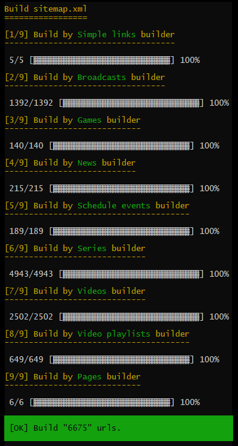

[](https://packagist.org/packages/gpslab/sitemap)
[](https://packagist.org/packages/gpslab/sitemap)
[](https://travis-ci.org/gpslab/sitemap)
[](https://coveralls.io/github/gpslab/sitemap?branch=master)
[](https://scrutinizer-ci.com/g/gpslab/sitemap/?branch=master)
[](https://styleci.io/repos/68381260)
[](https://github.com/gpslab/sitemap)

sitemap.xml builder
===================

This is a complex of services for build Sitemaps.xml and index of Sitemap.xml files.

See [protocol](https://www.sitemaps.org/protocol.html) for more details.



## Installation

Pretty simple with [Composer](http://packagist.org), run:

```sh
composer require gpslab/sitemap
```

## Simple usage

```php
// URLs on your site
$urls = [
   new Url(
       '/', // loc
       new \DateTimeImmutable('-10 minutes'), // lastmod
       ChangeFrequency::ALWAYS, // changefreq
       10 // priority
   ),
   new Url(
       '/contacts.html',
       new \DateTimeImmutable('-1 month'),
       ChangeFrequency::MONTHLY,
       7
   ),
   new Url(
       '/about.html',
       new \DateTimeImmutable('-2 month'),
       ChangeFrequency::MONTHLY,
       7
   ),
];

// file into which we will write a sitemap
$filename = __DIR__.'/sitemap.xml';

// web path to pages on your site
$web_path = 'https://example.com';

// configure stream
$render = new PlainTextSitemapRender($web_path);
$writer = new TempFileWriter();
$stream = new WritingStream($render, $writer, $filename);

// build sitemap.xml
$stream->open();
foreach ($urls as $url) {
    $stream->push($url);
}
$stream->close();
```

## URL builders

You can create a service that will return a links to pages of your site.

```php
class MySiteUrlBuilder implements UrlBuilder
{
    public function getIterator(): \Traversable
    {
        // add URLs on your site
        return new \ArrayIterator([
          new Url(
              '/', // loc
              new \DateTimeImmutable('-10 minutes'), // lastmod
              ChangeFrequency::ALWAYS, // changefreq
              10 // priority
          ),
          new Url(
              '/contacts.html',
              new \DateTimeImmutable('-1 month'),
              ChangeFrequency::MONTHLY,
              7
          ),
          new Url(
              '/about.html',
              new \DateTimeImmutable('-2 month'),
              ChangeFrequency::MONTHLY,
              7
          ),
       ]);
    }
}
```

It was a simple build. We add a builder more complicated.

```php
class ArticlesUrlBuilder implements UrlBuilder
{
    private $pdo;

    public function __construct(\PDO $pdo)
    {
        $this->pdo = $pdo;
    }

    public function getIterator(): \Traversable
    {
        $section_update_at = null;
        $sth = $this->pdo->query('SELECT id, update_at FROM article');
        $sth->execute();

        while ($row = $sth->fetch(PDO::FETCH_ASSOC)) {
            $update_at = new \DateTimeImmutable($row['update_at']);
            $section_update_at = max($section_update_at, $update_at);

            // SmartUrl automatically fills fields that it can
            yield new SmartUrl(
                sprintf('/article/%d', $row['id']),
                $update_at
            );
        }

        // link to section
        yield new Url(
            '/article/',
            $section_update_at ?: new \DateTimeImmutable('-1 day'),
            ChangeFrequency::DAILY,
            9
        );
    }
}
```

We take one of the exists builders and configure it.

```php
// collect a collection of builders
$builders = new MultiUrlBuilder([
    new MySiteUrlBuilder(),
    new ArticlesUrlBuilder(/* $pdo */),
]);

// file into which we will write a sitemap
$filename = __DIR__.'/sitemap.xml';

// web path to pages on your site
$web_path = 'https://example.com';

// configure stream
$render = new PlainTextSitemapRender($web_path);
$writer = new TempFileWriter();
$stream = new WritingStream($render, $writer, $filename);

// build sitemap.xml
$stream->open();
foreach ($builders as $url) {
    $stream->push($url);
}
$stream->close();
```

## Sitemap index

You can create [Sitemap index](https://www.sitemaps.org/protocol.html#index) to group multiple sitemap files. If you
have already created portions of the Sitemap, you can simply create the Sitemap index.

```php
// file into which we will write a sitemap
$filename = __DIR__.'/sitemap.xml';

// web path to the sitemap.xml on your site
$web_path = 'https://example.com';

// configure stream
$render = new PlainTextSitemapIndexRender($web_path);
$writer = new TempFileWriter();
$stream = new WritingIndexStream($render, $writer, $filename);

// build sitemap.xml index
$stream->open();
$stream->pushSitemap(new Sitemap('/sitemap_main.xml', new \DateTimeImmutable('-1 hour')));
$stream->pushSitemap(new Sitemap('/sitemap_news.xml', new \DateTimeImmutable('-1 hour')));
$stream->pushSitemap(new Sitemap('/sitemap_articles.xml', new \DateTimeImmutable('-1 hour')));
$stream->close();
```

## Split URLs and make Sitemap index

You can simplify splitting the list of URLs to partitions and creating a Sitemap index.

You can push URLs into the `WritingSplitIndexStream` stream and he will write them to the partition of the Sitemap.
Upon reaching the partition size limit, the stream closes this partition, adds it to the index and opens the next
partition. This simplifies the building of a big sitemap and eliminates the need for follow size limits.

You'll get a Sitemap index `sitemap.xml` and a few partitions `sitemap1.xml`, `sitemap2.xml`, `sitemapN.xml`  from a
large number of URLs.

```php
// collect a collection of builders
$builders = new MultiUrlBuilder([
    new MySiteUrlBuilder(),
    new ArticlesUrlBuilder(/* $pdo */),
]);

// file into which we will write a sitemap
$index_filename = __DIR__.'/sitemap.xml';

// web path to the sitemap.xml on your site
$index_web_path = 'https://example.com';

$index_render = new PlainTextSitemapIndexRender($index_web_path);
$index_writer = new TempFileWriter();

// file into which we will write a sitemap part
// filename should contain a directive like "%d"
$part_filename = __DIR__.'/sitemap%d.xml';

// web path to pages on your site
$part_web_path = 'https://example.com';

$part_render = new PlainTextSitemapRender($part_web_path);
// separate writer for part
// it's better not to use one writer as a part writer and a index writer
// this can cause conflicts in the writer
$part_writer = new TempFileWriter();

// configure stream
$stream = new WritingSplitIndexStream(
    $index_render,
    $part_render,
    $index_writer,
    $part_writer,
    $index_filename,
    $part_filename
);

$stream->open();

// build sitemap.xml index file and sitemap1.xml, sitemap2.xml, sitemapN.xml with URLs
$i = 0;
foreach ($builders as $url) {
    $stream->push($url);

    // not forget free memory
    if (++$i % 100 === 0) {
        gc_collect_cycles();
    }
}

// you can add a link to a sitemap created earlier
$stream->pushSitemap(new Sitemap('/sitemap_news.xml', new \DateTimeImmutable('-1 hour')));

$stream->close();
```

As a result, you will get a file structure like this:

```
sitemap.xml
sitemap1.xml
sitemap2.xml
sitemap3.xml
```

## Split URLs in groups

You may not want to break all URLs to a partitions like with `WritingSplitIndexStream` stream. You might want to make
several partition groups. For example, to create a partition group that contains only URLs to news on your website, a
partition group for articles, and a group with all other URLs.

This can help identify problems in a specific URLs group. Also, you can configure your application to reassemble only
individual groups if necessary, and not the entire map.

***Warning.** The list of partitions is stored in the `WritingSplitStream` stream and a large number of partitions
can use a lot of memory.*

```php
// file into which we will write a sitemap
$index_filename = __DIR__.'/sitemap.xml';

// web path to the sitemap.xml on your site
$index_web_path = 'https://example.com';

$index_render = new PlainTextSitemapIndexRender($index_web_path);
$index_writer = new TempFileWriter();

// web path to pages on your site
$part_web_path = 'https://example.com';

// separate writer for part
$part_writer = new TempFileWriter();
$part_render = new PlainTextSitemapRender($part_web_path);

// create a stream for news

// file into which we will write a sitemap part
// filename should contain a directive like "%d"
$news_filename = __DIR__.'/sitemap_news%d.xml';
// web path to sitemap parts on your site
$news_web_path = '/sitemap_news%d.xml';
$news_stream = new WritingSplitStream($part_render, $part_writer, $news_filename, $news_web_path);

// similarly create a stream for articles
$articles_filename = __DIR__.'/sitemap_articles%d.xml';
$articles_web_path = '/sitemap_articles%d.xml';
$articles_stream = new WritingSplitStream($part_render, $part_writer, $articles_filename, $articles_web_path);

// similarly create a main stream
$main_filename = __DIR__.'/sitemap_main%d.xml';
$main_web_path = '/sitemap_main%d.xml';
$main_stream = new WritingSplitStream($part_render, $part_writer, $main_filename, $main_web_path);

// build sitemap.xml index
$index_stream->open();

$news_stream->open();
// build parts of a sitemap group
foreach ($news_urls as $url) {
    $news_stream->push($url);
}

// add all parts to the index
foreach ($news_stream->getSitemaps() as $sitemap) {
    $index_stream->pushSitemap($sitemap);
}

// close the stream only after adding all parts to the index
// otherwise the list of parts will be cleared
$news_stream->close();

// similarly for articles stream
$articles_stream->open();
foreach ($article_urls as $url) {
    $articles_stream->push($url);
}
foreach ($articles_stream->getSitemaps() as $sitemap) {
    $index_stream->pushSitemap($sitemap);
}
$articles_stream->close();

// similarly for main stream
$main_stream->open();
foreach ($main_urls as $url) {
    $main_stream->push($url);
}
foreach ($main_stream->getSitemaps() as $sitemap) {
    $index_stream->pushSitemap($sitemap);
}
$main_stream->close();

// finish create index
$index_stream->close();
```

As a result, you will get a file structure like this:

```
sitemap.xml
sitemap_news1.xml
sitemap_news2.xml
sitemap_news3.xml
sitemap_articles1.xml
sitemap_articles2.xml
sitemap_articles3.xml
sitemap_main1.xml
sitemap_main2.xml
sitemap_main3.xml
```

## Streams

 * `MultiStream` - allows to use multiple streams as one;
 * `WritingStream` - use [`Writer`](#Writer) for write a Sitemap;
 * `WritingIndexStream` - writes a Sitemap index with [`Writer`](#Writer);
 * `WritingSplitIndexStream` - split list URLs to sitemap parts and write its with [`Writer`](#Writer) to a Sitemap
 index;
 * `WritingSplitStream` - split list URLs and write its with [`Writer`](#Writer) to a Sitemaps;
 * `OutputStream` - sends a Sitemap to the output buffer. You can use it
[in controllers](http://symfony.com/doc/current/components/http_foundation.html#streaming-a-response);
 * `LoggerStream` - use
 [PSR-3](https://github.com/php-fig/fig-standards/blob/master/accepted/PSR-3-logger-interface.md) for log added URLs.

You can use a composition of streams.

```php
$stream = new MultiStream(
    new LoggerStream(/* $logger */),
    new WritingSplitIndexStream(
        new PlainTextSitemapIndexRender('https://example.com'),
        new PlainTextSitemapRender('https://example.com'),
        new TempFileWriter(),
        new GzipTempFileWriter(9),
         __DIR__.'/sitemap.xml',
         __DIR__.'/sitemap%d.xml.gz'
    )
);
```

Streaming to file and compress result without index.

```php
$render = new PlainTextSitemapRender('https://example.com');

$stream = new MultiStream(
    new LoggerStream(/* $logger */),
    new WritingStream($render, new GzipTempFileWriter(9), __DIR__.'/sitemap.xml.gz'),
    new WritingStream($render, new TempFileWriter(), __DIR__.'/sitemap.xml')
);
```

Streaming to file and output buffer.

```php
$render = new PlainTextSitemapRender('https://example.com');

$stream = new MultiStream(
    new LoggerStream(/* $logger */),
    new WritingStream($render, new TempFileWriter(), __DIR__.'/sitemap.xml'),
    new OutputStream($render)
);
```

## Writer

 * `FileWriter` - write a Sitemap to the file;
 * `TempFileWriter` - write a Sitemap to the temporary file and move in to target directory after finish writing;
 * `GzipFileWriter` - write a Sitemap to the file compressed by gzip;
 * `GzipTempFileWriter` - write a Sitemap to the temporary file compressed by gzip and move in to target directory
 after finish writing.
 * `DeflateFileWriter` - write a Sitemap to the file compressed by deflate;
 * `DeflateTempFileWriter` - write a Sitemap to the temporary file compressed by deflate and move in to target
 directory after finish writing.

## Render

If you install the [XMLWriter](https://www.php.net/manual/en/book.xmlwriter.php) PHP extension, you can use
`XMLWriterSitemapRender` and `XMLWriterSitemapIndexRender`. Otherwise you can use `PlainTextSitemapRender` and
`PlainTextSitemapIndexRender` who do not require any dependencies and are more economical.

## License

This bundle is under the [MIT license](http://opensource.org/licenses/MIT). See the complete license in the file:
LICENSE
